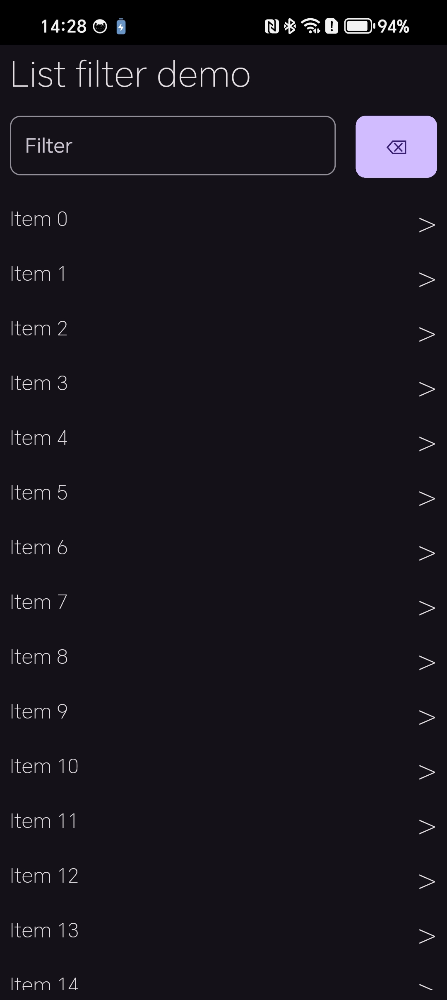

# Drift: List with text filter

## Quickstart

1. `go install github.com/go-drift/drift/cmd/drift@latest`
1. `drift run android --watch`

## Usage

- Tapping on an item writes to the log
- Enter text and click the action button on the popup keyboard to filter the list

## Screenshot

